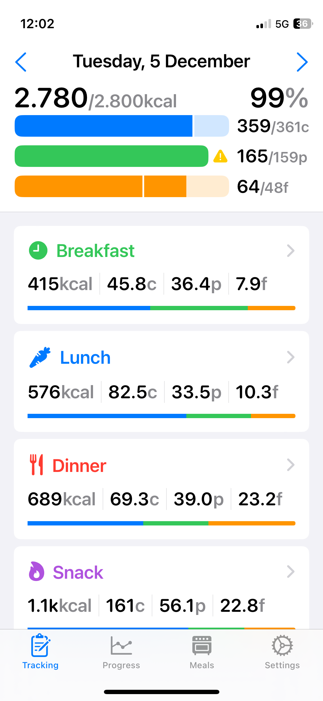
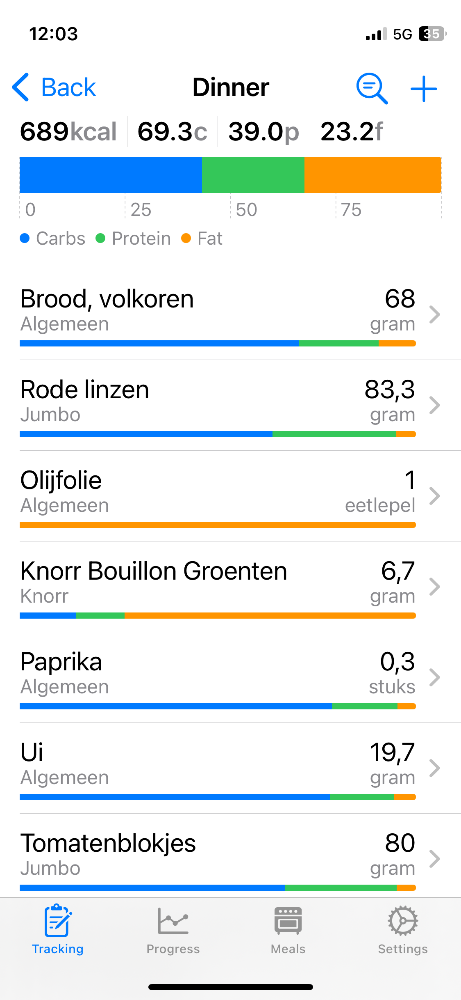
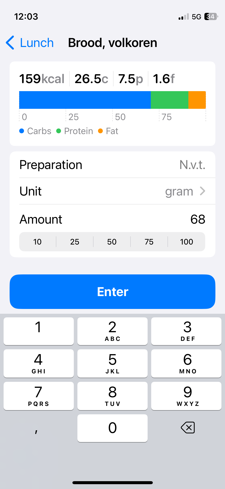
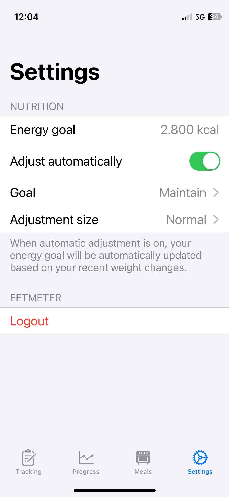

# Vreetmeter 🍽️
An experimental project, my first ever app and first ever Swift project. But I ended up using this on a daily basis, so now I am stuck developing it :,). It integrates with HealthKit and the API from Voedingcentrum to give insight into your diet. I have no plans to publish this to the AppStore, it is a learning project and intended for personal use only.

  
  
  
  

## Features
- Integrates with the Eetmeter API from Voedingscentrum for the most complete data available
- Synchronizes nutritional data with HealthKit
- Reads body mass from HealthKit to automatically determine goals
- Adds easy previews before add a consumption to help choose the right food

## License 📄
[MIT](license)
